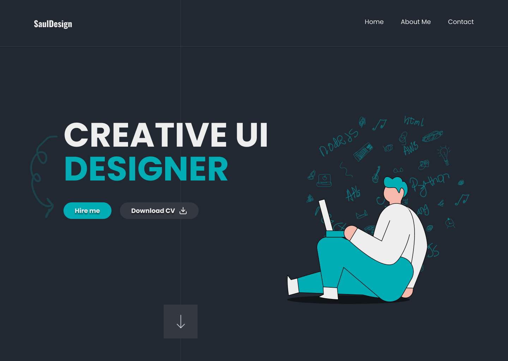

# Portfolio Développeur

Bienvenue dans mon projet de **Portfolio Développeur** ! Ce projet a pour objectif de présenter mes compétences, mes projets et mon parcours professionnel de manière simple, élégante et interactive, en utilisant uniquement HTML et CSS. À noter que le design de ce portfolio est basé sur une maquette web existante, qui a inspiré la structure et l'apparence générale du site.


## 🎯 Objectif

Le but de ce projet de portfolio est de servir d’entraînement et de démontrer mes compétences en développement web. Il s'agit d'un portfolio statique qui offre une navigation fluide, des animations subtiles, et qui est responsive pour s'adapter aux différents écrans. Ce projet vise également à mettre en pratique mes connaissances en HTML et CSS tout en me permettant de créer une vitrine pour d'éventuels projets futurs.


## 🚀 Fonctionnalités

- **Page d'accueil** avec une brève présentation.
- **Section Compétences** pour mettre en avant les technologies maîtrisées.
- **Section Projets** pour présenter les projets réalisés (avec captures d'écran et descriptions).
- **Section Contact** pour faciliter la prise de contact avec des liens vers les réseaux sociaux.
- **Design responsive** pour une expérience optimisée sur mobile, tablette, et desktop.
  
## 📷 Aperçu


Figma : https://www.figma.com/design/D8y58y2KiDfeKUPYAmiR4Z/Portfolio-Website-Design-(Community)?node-id=0-1&node-type=canvas&t=1sDHzfhbXKS7QP6i-0

## 🛠️ Technologies Utilisées

- **HTML5** - Structure sémantique des pages
- **CSS3** - Styles, animations et responsive design

## 📂 Structure des Fichiers
 ```
portfolio/ 
├── index.html # Fichier principal HTML 
├── style/
|     └── style.css # Fichier principal   
└── resources/ # Dossier contenant les images et les fonts
    └── font/ # Dossier contenant les fonts
    └── imgs/ # Dossier contenant les images
 ```
## ⚙️ Installation

1. **Clonez le dépôt :**
   ```bash
   git clone https://github.com/foenix208/Portfolio_Ui_DESIGNER_Vitrine.git
   ```
2. Ouvrez le fichier index.html dans votre navigateur préféré pour voir le portfolio.
## 🔧 Personnalisation

Pour personnaliser ce portfolio :

- Modifiez le contenu du fichier `index.html` pour y ajouter vos propres informations, compétences et projets.
- Adaptez les styles dans `style.css` selon vos préférences en termes de couleurs, typographies, et mises en page.
